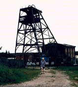

### ABERDARON BY THE SEA
We've come from Ross; t'was very far;  
We've reached the Llyn Peninsular.  
Our camp site's high above the beach,  
But one that is in easy reach  
Of Aberdaron by the sea. 

Down winding path to shoreline clean  
No crowds, no trippers mar the scene.  
We wend our way to hear the roar  
As wave on wave beat on the shore. 

The sea, the sea, it beckons me;  
I cannot funk it, for you seem  
I have my costume here with me;  
So de trop in ' 43,  
Well darned and patched around the knee. 

I make my way across the rocks,  
Made tougher still by lack of socks,  
Then, bidding fond farewell to Mij,  
I plunge into this foaming fridge. 

I fight with all the strength within,  
Until the waves caress my chin;  
Then pick me up with one big roar  
And fling me back upon the shore.  
Experience teaches , so they say,  
But I'll be back another day. 
            
            
            
            
### LOCH LOMOND 1975
"Oh boatman row me o'er the loch";  
"I will, I will, when I find me sock". 
"Oh boatman! boatman, hurry do!"   
"I will, I will, when I find me shoe". 
!Oh man take heed to my request"  
"Oh where on earth did I put me vest?" 
"Oh put your clothes back on the shelf  
I'll row the ruddy boat myself" 
            

### A NICE LITTLE PLACE - Oct.1995

We've rented a cottage beside the sea;  
The stay is enriching our lives,  
We're only here for a week you see,   
Nice little place - St. Ives!   

The surfers go out in the early morn;  
Husbands as well as their wives.   
The artists are busy a-painting the dawn;  
Quaint little place - St. Ives!   
A seagull wheels in the face of the breeze,  
It glides on the wind - then dives;  
Fishing boats tug at their anchor chains;   
Magical place - St. Ives!   

Seals are sporting beneath the boats,  
Having the time of their lives.  
Surfacing now with their speckled coats;   
Glorious place - St. Ives.   
Heaven on earth - St. Ives.   

### NEAR ST. AUSTELL - CORNWALL - Sept.1991
Far from the crowds we went one day,  
Over the hills and far away;  
To Boscastle, Tintagel too;  
Wife and I and Mijicoo.   
We've seen how people spend their lives  
In Mevagissy and St. Ives,  
And seen fresh views   
Round every bend,  
Until, at last, we've reached Land's End.  
We've looked down on wrinkled waves   
And watched the spume   
From blowhole caves.   
We've watched the seagulls' wheeling flight   
Then land on ledges out of sight.  
Oh! What a heavenly life is ours   
When camping 'neath   
The twinkling stars.   

### The Tickle Tiger - 1993
I am the Tickle Tiger   
And I tickle girls and boys;  
I tickle on the tummy  
When they make lots of noise.  
And sometimes when they're very bad  
I tickle on the nose.   
They don't know when I'll tickle   
'Cos I like to make them guess;   
They'll even get a tickle   
When they're playing games of chess.   
I'll come right up behind them  
When they don't know that I'm there;  
And I'll tickle! tickle! tickle!   
Till they fall right off the chair.

### BEVIN BOYS (written for Chris)   
  
I was due to go into the army but so many miners had been called up 
for the army and the country needed so much coal that I was sent to
be a miner instead of a soldier.  

I was sent to Derbyshire in May 1944 to do my training. We had just 
six weeks to train. When we were finished we were sent to different 
mines or collieries. I was taken to my "digs" with another young man 
and we had experience at the pit top sorting different sizes of coal. 
This lasted two weeks and was very boring and very, very, noisy.  

Next we had to go down the mine. There I was shown how to couple the 
trucks of coal which came from the coal face. The coal face was about 
a quarter of a mile from the pit bottom. We each had a lamp hooked onto 
our belts and we wore helmets to protect our heads from falling rock 
and from banging our heads on the very low roofs. It is just as well 
I was wearing a helmet one day because I was knocked out by a huge piece 
of coal that fell off a conveyer belt. All I remember was waking up 
to the smell of Dettol. I still bear a black scar behind my ear.  

Some of the time I had to move heavy rails and although I wore thick 
gloves the palms of my hands peeled. Eventually I got quite used to 
working without gloves at all.   

We worked from 7am. to 2.30pm. with a quarter of an hour for "snap" 
which was what lunch was called. My landlady put my lunch in a box but 
it was a very dirty place to eat. There was no place to wash underground 
and no toilets.   

When we arrived for work we collected our lamps and a "tally". This 
was a metal "ticket" with your own number on it. When you got to the 
bottom of the pit shaft you handed it in and it was hung on a board. 
This way it was always known who was down in the pit. This might be 
very important if there was an accident.   

The "cage", which the lift was called, held about ten men and went down 
to the bottom at such speed that you thought your stomach was going 
to come out of your mouth.  

For some time I was in charge of a pit pony. I had to go down to a part 
of the mine where the roof was falling in. I had to put new wooden pit 
props in and take the old ones out and back to the pit bottom. One day 
when we were having snap the old miner I was working with hung the lamps 
on the back of the "tub" or wagon. The pony, which was harnessed to 
the tub, took fright at something and bolted back to his stable taking 
the lamps with him and leaving us in pitch darkness. I had to feel my 
way, doubled up because the roof was so low, until I found the pony 
again. He had stopped when he had come to a screen.  

When my shift finished I always took the pony back to its underground 
stall. It was fed on hay and given water. The ponies stayed down most 
of the time and were only brought up during holiday time.

Ours was a modern pit and there were showers for us when we finished 
our shifts. Coal dust got into every part of you, even into the corners 
of your eyes. It took a few days away from the pit for you to be really 
clean. When we came in for our morning shift we had to change into our 
dirty clothes. These were given a wash every two weeks. You got used 
to getting in to dirty clothes.

I was in the mines for three and a half years and was glad I did not 
have to stay in for ever.

Three years ago I was on holiday in Derbyshire and went to see what 
had happened to the mine I had spent so much time in. The colliery had 
shut down and all that was left was the pit head and the big wheel that 
ran the cages and the ventilation. 

### From the Gower - May 1989

O, bend your ears   
Good Gentles all   
And to our tale attend,   
For here upon the Gower Peninch   
Midst sound of cuckoo and the finch;   
Where boats are hauled ashore by winch;   
The skylark rises inch by inch;   
When feet begin to feel the pinch'   
To you our thoughts we send.

### From the New Forest.
To Lulworth Cove from Savernake   
And thence to Durdle Door,   
We've wandered with our haversack   
And trodden every shore.   
Now see Good Gentles round us laze  
Among New Forest's trees.   
They're soaking up the golden rays:   
"Recharging batteries" 

### Harry Tuffin
(A cheap supermarket near a family camp)  
My dear old mother said to me'  
"I'd really like some muffins"   
And where d'ya think I got them from?   
Why, dear old Harry Tuffin's.

I bought a two pound chicken once   
Which didn't need no stuffin,   
From whence it came you can't go wrong   
Why dear old Harry Tuffin.

Ann bought a bike for exercise  
Which caused her lots of puffin!   
But now she is so very fit -   
Its thanks to Harry Tuffin.

Paul's juggling is coming on,  
Which also leaves him puffin.   
Of course he bought his juggling kit   
From noble Harry Tuffin.

The Royal Household sent out cards   
To rich and those with nuffin;   
And whose the latest on her list  
Noble Harry Tuffin.

Sad to say this very morn  
I heard some mournful news   
That noble Harry Tuffin  
Was dead beneath the yews.

His gravestone was a granite block,  
Engraving so divine,  
His relatives had bought the plot   
For three pounds ninety nine.

So cheer up all you campers   
Spare thoughts for all those who   
Have never had a bargain   
From noble - "You know who".

I've been the length and breadth the land  
From Notts to Knotty Ash   
I've heard the registers ring out   
When taking lots of cash   
And by and large I tell with pride   
I'll even tell the puffins;   
There is no other shop on earth   
Compares with harry Tuffin's.

We've had a lovely barbeque   
Enjoyed by lads and lasses.   
We've stuffed our little faces  
And quaffed wine from lots of glasses.  
So raise your glass and tho'   
The words you say your fluffing.   
Though he's been dead for forty years   
"Long Live Sir Harry Tuffin".
